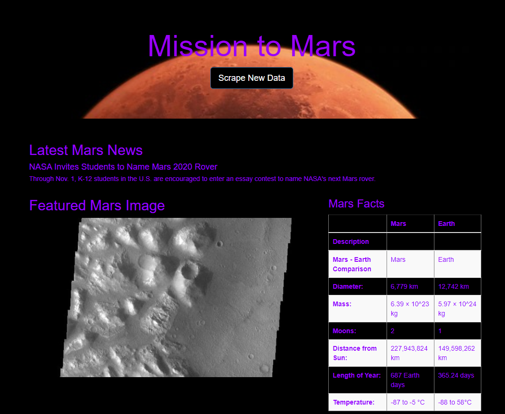
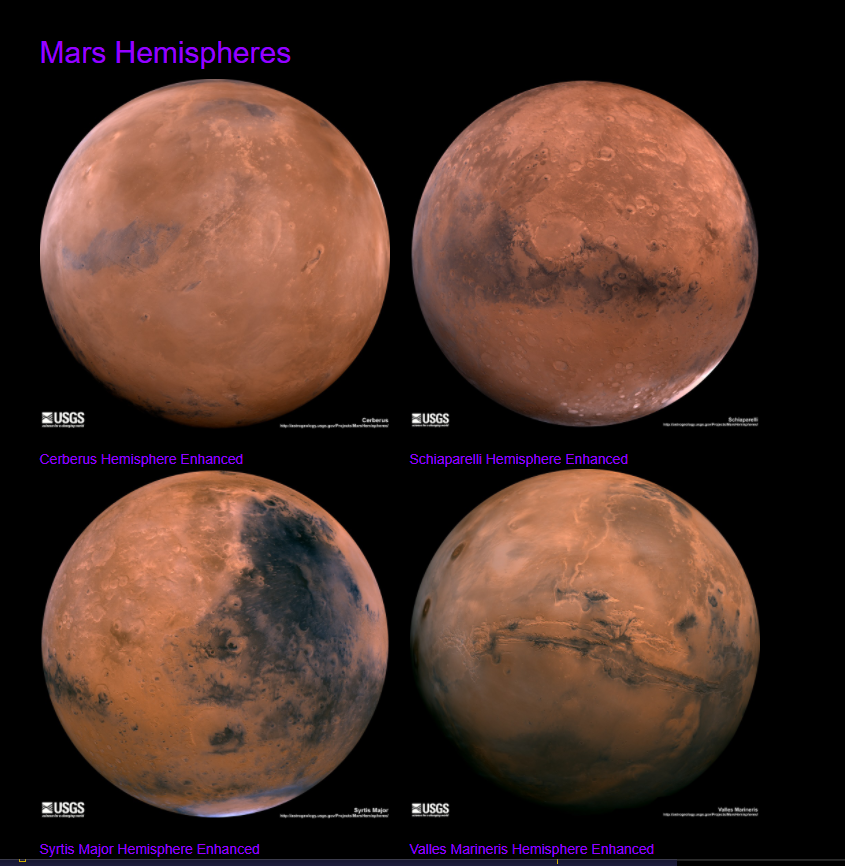

# Mission-to-Mars
Using a Web Application to Scrape Information to Present in a Single HTML Page

## Overview
The purpose of this project is to use BeautifulSoup and Splinter to automate web-scraping and store the data using Mongo. Then Flask is used to create a web applicaton to display the data in a single html page.
- Latest Mars News - Scraped from https://mars.nasa.gov/news
- Featured Image - Scraped from https://spaceimages-mars.com 
- Mars Facts - Scraped from https://galaxyfacts-mars.com
- Mars Hemispheres - Scraped from https://marshemispheres.com

